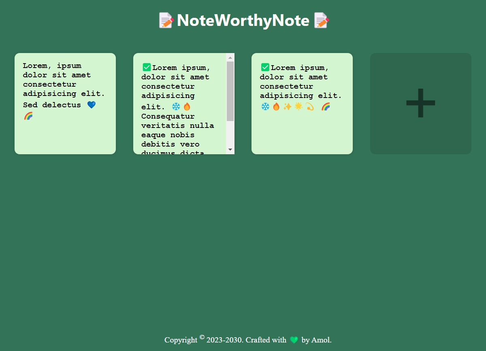

# 📝🔥 NoteWorthyNote - Sticky Notes Web Application 🌈✨

**NoteWorthyNote** is a simple and intuitive sticky notes app that allows you to create, read, update and delete notes. The app saves your notes locally in the browser's local storage, ensuring that your notes persist even after refreshing the page.

## 

## 

## 🛠️ Tech Stack

- 🌐 **HTML5**
- 🎨 **CSS3**
- ☕ **JavaScript**

## Features

- ➕ Create new notes : 📝Create your note by clicking on "Add icon"(+) button to seamlessly add sticky note.
- ✏️ Edit existing notes : 👆Click on the whichever notes container textarea to instantly edit its content inline. Your changes will be applied in real-time.
- ❌ Delete notes : 👆💾simply Double-click on note to delete. It will show pop-up confirmation to delete that particular note. And after confirming it will delete the note.

## 🔍 How it Works

- 🔄 **Local Storage**: NoteWorthyNote leverages the browser's local storage to save and manage notes. On page load, notes are retrieved from localStorage and displayed, ensuring your data is always available.

## 📝 Contributing

Contributions are welcome! If you have any ideas for improvements or new features, feel free to **open an issue** or **submit a pull request**.🙌

## 👤 Author

NoteWorthyNote is crafted with 💚 by **Amol**. 🌟
